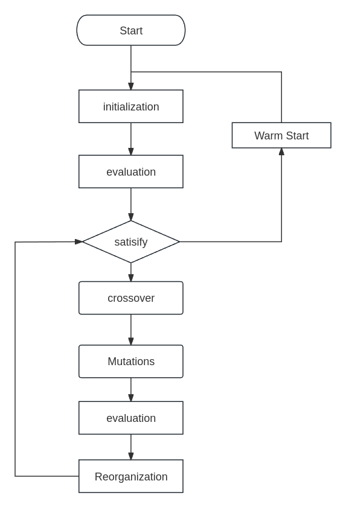

### FLOW

### Problem Example
$$
\text{min} \space x+y+x^2+xy+y^2+yz+z^2\\\
\text{s.t.} \space x+2y+3z-4 \leq 0\\\
x+y-1 \leq 0\\\
x, y, z \geq 0\\\
x, y, z \leq 100
$$

$$
f(x)=x^TQx+k^Tx + \lambda Cx$$
$$
x=\begin{bmatrix}x\\\ y\\\ z \\\ 1\end{bmatrix},
$$

$$
Q=\begin{bmatrix}1&0.5 &0&0\\\1&0.5&1&0\\\0&1&2&0\\\0&0&0&0 \end{bmatrix},
$$

$$
k=\begin{bmatrix}1&1&0&0\end{bmatrix},
$$

$$
\lambda = \begin{bmatrix}\lambda_1\\\ \lambda_2 \end{bmatrix},
$$

$$
C=\begin{bmatrix}-1&-2&-3&4\\\ -1&-1&0&1\end{bmatrix}
$$
<!-- x = 
      _
     | x |
x  = | y |
     | z |
     |_1_|

Q = 
      _                            _
     |  1    0.5    0    0         |
     | 0.5     1    0    0         |
Q  = |   0     1    2    0         |
     |_  0     0    0    0        _|

k = [ 1, 1, 0, 0 ]

λ = 
       _
      | λ₁ |
λ  =  |_λ₂_|

C = 
      _                       _
     | -1   -2   -3    4      |
C  = | -1   -1    0    1      |
     |_                     _| -->

### Crossover
$$
u_{j, i} = \begin{aligned}v_{j, i}&& \text{if rand[0,1)}\leq CR_i \\\ x_{j,i} &&\text{otherwise} \end{aligned}
$$
- j: the j dimension of  individual
- i: the i individual in whole cluster
- $x_{j, i}$: the j element of individual
When rand[0,1] is less than or equal to the crossover rate $CR_i$, the j-th dimension of the experimental individual u will inherit the j-th dimension of the variant individual v, otherwise it will inherit the j-th dimension of the original individual x.
### Mutation:
$$
V_{j,i} = x_{j, i} + F_i (x_{p,best} – x_{j, i}) + F_i (x_{r1} - x_{r2}) $$
$$
F_i = rand(M_F, ri, 0.1)
$$
- $x_{p, best}$: Randomly select from the top p individuals in the current population in terms of fitness
- $x_{j, i}$: the j element of individual i
- $x_{r1}$: randomly select from the whole population
- $x_{r2}$: randomly select from the whole population
- $M_{F}$: Randomly select from historical memory $M_F$
### Reorganize
$$
x_{i, G+1} = \lbrace \begin{aligned}u_{i, G}&& \text{if }f(u_{i, G})\leq f(x_{i, G}) \\\
            x_{i, G} &&\text{otherwise} \end{aligned} \\
$$

$$
M_{CR, k, G+1} = \lbrace \begin{aligned}\frac{\sum_{k=1}^{S_{CR}}w_k S_{CR, k}^2}{\sum_{k=1}^{S_{CR}}w_k S_{CR, k}} \\\
M_{CR,k, G}&& \text{otherwise}\end{aligned}
$$

$$
M_{F, k, G+1} = \lbrace \begin{aligned}\frac{\sum_{k=1}^{S_{F}}w_k S_{F, k}^2}{\sum_{k=1}^{S_{F}}w_k S_{F, k}} \\\
M_{F,k, G}&& \text{otherwise}\end{aligned}
$$

$$
w_k = \frac{\Delta f_k}{\sum_{k=1}^{|S_{CR}|}\Delta f_i}
$$

$$
\Delta f_k=|f(\mu_{k,G}) - f(x_k, G)|
$$
- G: the index of generation G 
- u_{i,G}$ : New individuals generated after mutation
- $x_{i, G}$: the original individuals
- $S_{CR}$: CR of successfully evolved individuals
- $S_{F}$: F of successfully evolved individuals
- $x_{r2}$: randomly select from the whole population