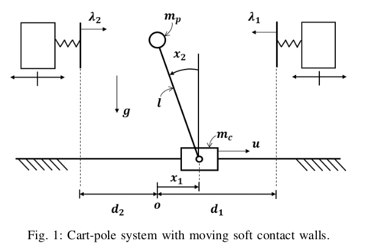
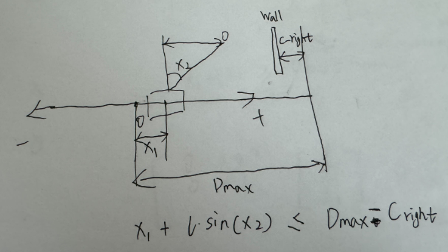

### System

Set the state variable as $x_1 = pos, x_2 = \theta, x_3 = v, x_4 = \dot \theta$. And the runtime step is $\Delta t = 0.2$. The system can be described as:
$$
\dot{\mathbf{x}} = Ax+Bu+E\lambda\\
\dot{\mathbf{x}} =
\begin{bmatrix}
0 & 0 & 1 & 0 \\
0 & 0 & 0 & 1 \\
0 & \frac{g m_p}{m_c} & 0 & 0 \\
0 & \frac{g (m_c + m_p)}{l m_c} & 0 & 0
\end{bmatrix}
\mathbf{x}
+
\begin{bmatrix}
0 \\
0 \\
\frac{1}{m_c} \\
\frac{1}{l m_c}
\end{bmatrix}
u
+
\begin{bmatrix}
0 & 0 \\
0 & 0 \\
0 & 0 \\
\frac{1}{l m_p} & \frac{1}{l m_p}
\end{bmatrix}
\begin{bmatrix}
\lambda_1 \\
\lambda_2
\end{bmatrix}.\\

\mathbf{x}_{k+1} =
\left(
\mathbf{I} + \Delta t
\begin{bmatrix}
0 & 0 & 1 & 0 \\
0 & 0 & 0 & 1 \\
0 & \frac{g m_p}{m_c} & 0 & 0 \\
0 & \frac{g (m_c + m_p)}{l m_c} & 0 & 0
\end{bmatrix}
\right) \mathbf{x}_k
+
\Delta t
\begin{bmatrix}
0 \\
0 \\
\frac{1}{m_c} \\
\frac{1}{l m_c}
\end{bmatrix}
u_k
+
\Delta t
\begin{bmatrix}
0 & 0 \\
0 & 0 \\
0 & 0 \\
\frac{1}{l m_p} & \frac{1}{l m_p}
\end{bmatrix}
\begin{bmatrix}
\lambda_1 \\
\lambda_2
\end{bmatrix}.
$$
where $\lambda$ is the force from the left and right wall. $\lambda_1$ is the left, $\lambda_2$ is the right wall.

Constraints of system:

- cart position constraint: $-0.6 \leq x_1 \leq 0.6$

- theta constraint: $-\pi/2 \leq x_2 \leq \pi/2$

- speed constraint: $-2*0.6 / \Delta t \leq x_3 \leq 2*0.6/ \Delta t$, where 2*0.6 is the available space for cart pole

- $\dot \theta$ constraint: $-\frac{\pi}{\Delta t} \leq x_4 \leq \frac{\pi}{\Delta t}$

- control input (u) constraint: $-20 \leq u \leq 20$

- $\lambda$  constraint: $0 \leq \lambda_1 \leq 20$, $-20 \leq \lambda_2 \leq 0$, $0 \leq \lambda_1 \leq u_{max}$, $-u_{max} \leq \lambda_2 \leq 0$

- cart and pole position constraint:

  

  - $x_1 + l x_2 \leq -c_{right} + D_{max}$,

  - $x_1 + l x_2 \geq c_{left} - D_{max}$, 

  - $D_{max} = 0.6$

    where $D_{max}$ is the maximal distance from origin, $c_{left, right}$ is the bias of left or right wall from the $D_{max}$

$$
E = I + \Delta T \begin{bmatrix}
0 & 0 & 1 & 0 \\
0 & 0 & 0 & 1 \\
0 & \frac{g m_p}{m_c} & 0 & 0 \\
0 & \frac{g (m_c + m_p)}{\ell m_c} & 0 & 0
\end{bmatrix}
$$

$$
F = \Delta T \begin{bmatrix}
0 & 0 & 0 \\
0 & 0 & 0 \\
\frac{1}{m_c} & 0 & 0 \\
\frac{1}{\ell m_c} & \frac{1}{\ell m_p} & -\frac{1}{\ell m_p}
\end{bmatrix}
$$

$$
G = \mathbf{0}_{\text{len}_x \times \text{len}_z}
$$

$$
H_1 = \begin{bmatrix}
0 & 0 & 0 & 0 \\
0 & 0 & 0 & 0 \\
-1 & \ell & 0 & 0 \\
1 & -\ell & 0 & 0 \\
1 & -\ell & 0 & 0 \\
-1 & \ell & 0 & 0 \\
1 & 0 & 0 & 0 \\
-1 & 0 & 0 & 0 \\
0 & 1 & 0 & 0 \\
0 & -1 & 0 & 0 \\
0 & 0 & 1 & 0 \\
0 & 0 & -1 & 0 \\
0 & 0 & 0 & 1 \\
0 & 0 & 0 & -1 \\
0 & 0 & 0 & 0 \\
0 & 0 & 0 & 0 \\
0 & 0 & 0 & 0 \\
0 & 0 & 0 & 0 \\
0 & 0 & 0 & 0 \\
0 & 0 & 0 & 0
\end{bmatrix},
H_2 = \begin{bmatrix}
0 & 1 & 0 \\
0 & 0 & 1 \\
0 & \frac{1}{k_1} & 0 \\
0 & -\frac{1}{k_1} & 0 \\
0 & 0 & \frac{1}{k_2} \\
0 & 0 & -\frac{1}{k_2} \\
0 & 0 & 0 \\
0 & 0 & 0 \\
0 & 0 & 0 \\
0 & 0 & 0 \\
0 & 0 & 0 \\
0 & 0 & 0 \\
0 & 0 & 0 \\
0 & 0 & 0 \\
1 & 0 & 0 \\
-1 & 0 & 0 \\
0 & 1 & 0 \\
0 & -1 & 0 \\
0 & 0 & 1 \\
0 & 0 & -1
\end{bmatrix},
H_3 = \begin{bmatrix}
-\lambda_{\text{max}} & 0 \\
0 & -\lambda_{\text{max}} \\
D_{\text{max}} & 0 \\
0 & 0 \\
0 & D_{\text{max}} \\
0 & 0 \\
0 & 0 \\
0 & 0 \\
0 & 0 \\
0 & 0 \\
0 & 0 \\
0 & 0 \\
0 & 0 \\
0 & 0 \\
0 & 0 \\
0 & 0 \\
0 & 0 \\
0 & 0 \\
0 & 0 \\
0 & 0
\end{bmatrix}
$$

$$
h_\theta = \begin{bmatrix}
0 \\
0 \\
-d_{\text{right}} + D_{\text{max}} \\
d_{\text{right}} \\
-d_{\text{left}} + D_{\text{max}} \\
d_{\text{left}} \\
x_{\text{ub}}[0] \\
-x_{\text{lb}}[0] \\
x_{\text{ub}}[1] \\
-x_{\text{lb}}[1] \\
x_{\text{ub}}[2] \\
-x_{\text{lb}}[2] \\
x_{\text{ub}}[3] \\
-x_{\text{lb}}[3] \\
u_{\text{max}} \\
u_{\text{max}} \\
\lambda_{\text{max}} \\
0 \\
\lambda_{\text{max}} \\
0
\end{bmatrix}
$$

